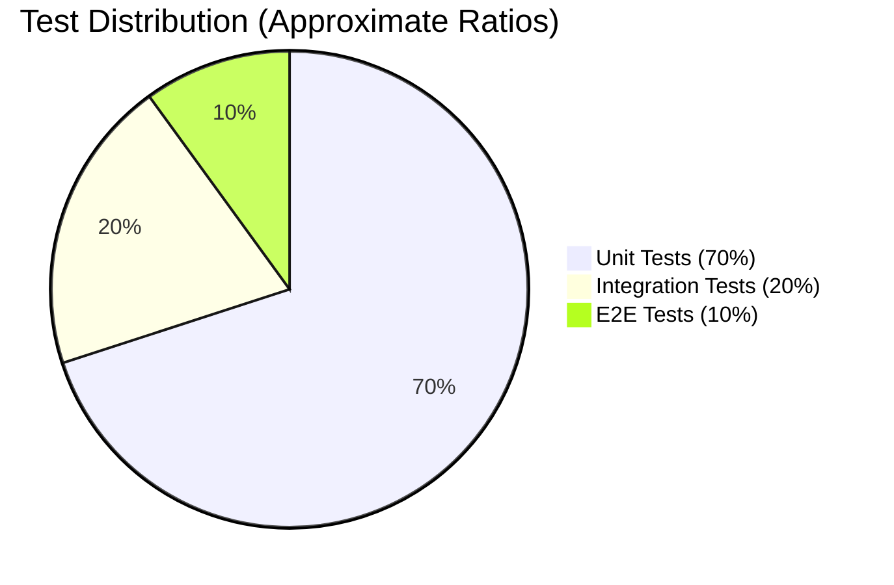

# Testomancer


**Software testing strategy and implementation guidance for AI agents**

Testomancer is a specialized skill designed for [Opencode](https://github.com/anomalyco/opencode) that transforms any AI agent into a senior software testing expert. It provides structured guidance on testing strategy, implementation best practices, and actionable recommendations across all testing levels.

> **Foundations:** Testomancer is built on ISTQB testing principles and terminology (Component Testing, Integration Testing, System Testing, etc.) combined with modern AI agent practices. Test generation strictly follows Karpathy agent guidelines: **state assumptions clearly**, **define verifiable success criteria first**, **keep changes surgical and minimal**, **use a test-first mindset**, and **verify thoroughly before moving forward**.

## What It Does

Testomancer analyzes your codebase and delivers testing recommendations:

- **Codebase Analysis** - Detects languages, frameworks, architecture
- **Best Practices Audit** - Checks compliance with standards
- **Level Recommendations** - Unit, Integration, Functional, or E2E
- **Library Suggestions** - With justification for your stack
- **Code Templates** - Jumpstart test implementation
- **CI/CD Guidance** - Automation and reporting

## Quick Start

```
"How should I create unit tests for my Python authentication module?"
```

**Expected Testomancer output:**

```
1. Codebase Analysis
   - Detected: Python with pytest
   - Module: auth.py (authentication logic)

2. Testing Level: Unit Tests
   - Target: validate_credentials(), hash_password(), verify_token()
   - Use pytest-mock for external dependencies

3. Recommended Structure
   tests/
   ├── __init__.py
   ├── conftest.py           # Shared fixtures
   └── test_auth.py        # Unit tests

4. Template
   def test_validate_credentials_success():
       # Arrange
       credentials = {"username": "user", "password": "pass123"}
       # Act
       result = validate_credentials(credentials)
       # Assert
       assert result is True
```

## Covered Testing Levels (ISTQB-Aligned)

| Level | ISTQB Term | Description |
|-------|---------------|-------------|
| **Unit Tests** | Component Testing | Individual functions, methods, and classes in isolation |
| **Integration Tests** | Integration Testing | Interactions between modules, components, and external services |
| **Functional Tests** | System Testing (functional) | Validation of business requirements and user stories |
| **End-to-End Tests** | End-to-End / Acceptance Testing | Complete user journeys and full system behavior |

## Installation

> **Note:** Testomancer requires Opencode v0.8.0 or later. Run `opencode --version` to check your version.

### Option 1: Automatic Installation (Recommended)

Copy the `testomancer` skill folder to your Opencode skills directory:

```bash
cp -r testomancer ~/.agents/skills/
```

### Option 2: Manual Installation

1. Clone or download this repository
2. Copy the entire `testomancer` folder to:
   ```bash
   ~/.agents/skills/testomancer/
   ```
3. Restart Opencode

### Verify Installation

After installation, Testomancer will be automatically invoked when you ask testing-related questions:

```
"How should I test my Python API?"
"Create unit tests for my authentication module"
"What's the best testing strategy for my React app?"
```

## Usage

When Testomancer is active, it will:

1. Analyze your codebase structure
2. Perform a best practices audit
3. Confirm the optimal testing level
4. Provide prioritized recommendations with code examples
5. Offer next steps for implementation

### Example Response Structure

```
1. Codebase Analysis
   - Detected: Node.js + Express + PostgreSQL
   - Critical areas: Auth, Payment processing
   - Existing coverage: 45%

2. Best Practices Compliance
   - ✅ Good isolation on auth tests
   - ⚠️ Missing mocks on database calls
   - 💡 Suggest using test doubles

3. Recommendations
   - Priority: Unit tests for validation logic
   - Library: Jest + supertest for API testing
   - Templates...

4. Next Steps
   - Ready to generate test code?
```

## Testing Pyramid



| Level | Ratio | Speed | Reliability |
|-------|-------|-------|-------------|
| Unit Tests | ~70% | Fast (ms) | High |
| Integration Tests | ~20% | Medium (s) | Medium |
| E2E Tests | ~10% | Slow (min) | Lower |

Testomancer follows the **Testing Pyramid** principle:
- **More Unit Tests** at the base (fast, isolated, deterministic)
- **Moderate Integration Tests** in the middle
- **Fewer End-to-End Tests** at the top (slower, more complex)

### Core Principles (ISTQB-Aligned)

Testomancer aligns with the **ISTQB 7 Testing Principles**:

1. **Testing shows presence of defects** — not their absence
2. **Exhaustive testing is impossible** — prioritize critical paths
3. **Early testing saves time and money** — test from the start
4. **Defects cluster together** — focus on risky areas
5. **Beware of the pesticide paradox** — tests must evolve
6. **Testing is context-dependent** — choose the right level
7. **Absence of errors is a fallacy** — verify requirements
8. **Risk-based testing** — focus resources on highest-risk areas first

> **Test Process (ISTQB):** Planning → Analysis → Implementation → Evaluation → Closure

Testomancer guides you through this lifecycle at every level.

---

## Philosophy / Standards & Guidelines

Testomancer combines three foundational frameworks:

1. **ISTQB Framework** — Testing levels (Component → Integration → System → Acceptance), test process (Planning → Analysis → Implementation → Evaluation → Closure), and 7 core principles
2. **Testing Pyramid** — 70% Unit / 20% Integration / 10% E2E distribution focused on speed and isolation
3. **Karpathy Agent Guidelines** — State assumptions clearly, define success criteria first, keep changes surgical, verify thoroughly

> These frameworks work together: ISTQB provides terminology and process, the Pyramid guides test distribution, and Karpathy rules govern AI behavior during test generation.

### AI Behavior (Karpathy-Style)

The skill incorporates **Karpathy-style agent guidelines** for test generation:
- **State assumptions** explicitly before writing tests
- **Test-first approach** where applicable
- **Surgical changes** — minimal, targeted edits
- **Goal-driven verification** — define success criteria first

## Supported Languages & Frameworks (2026)

| Framework | Language | Type | Status | Notes |
|-----------|----------|------|--------|-------|
| **Playwright** | Python/JS/TS | Web (E2E) | Supported | 2026 Leader |
| Selenium | Python/Java/JS/C# | Web (E2E) | Supported | Legacy |
| Appium | Python/Java/JS | Mobile | Supported | Cross-platform |
| Robot Framework | Python | Generic | Supported | Keyword-driven |

## Project Structure

```
testomancer/
├── SKILL.md              # Main skill definition
└── references/
    ├── [unit_tests.md]         # Unit testing (Component Testing ISTQB)
    ├── [integration_tests.md]  # Integration testing (Component Integration ISTQB)
    ├── [functional_tests.md]     # Functional/System testing (ISTQB)
    ├── [e2e_tests.md]         # End-to-End testing (Acceptance ISTQB)
    ├── [best_practices.md]     # Cross-language best practices audit
    ├── [specific_rules.md]    # Project-specific overrides
    └── [karpathy-guidelines.md] # Karpathy-style test generation
```

> **Quick Navigation:** Click any reference file above for level-specific guidance, ISTQB mapping, Karpathy rules, and prompt templates.

## Compliance & Guidelines

Testomancer aligns with industry standards:

- **ISTQB Mapping:** Each testing level maps to ISTQB terms (see table above). Detailed definitions in `references/*.md` files.
- **Karpathy Guidelines:** Always apply `karpathy-guidelines.md` for code suggestions — simplicity, surgical changes, explicit assumptions, goal-driven verification.
- **Project-Specific Rules:** Override defaults in `specific_rules.md` if needed.

## Contributing

Contributions welcome!

- For project-specific rules, see [`specific_rules.md`](testomancer/references/specific_rules.md)
- For detailed testing guidance, see files in [`references/`](testomancer/references/) folder
- Follow the Karpathy Guidelines when adding test code

## Roadmap

Planned future enhancements:

- [ ] Integration with the appsec toolchain (security testing)
- [ ] Integration with ContinuousTesting by Digital.AI for remote launch of tests on Browsers and devices

---

## License

MIT
