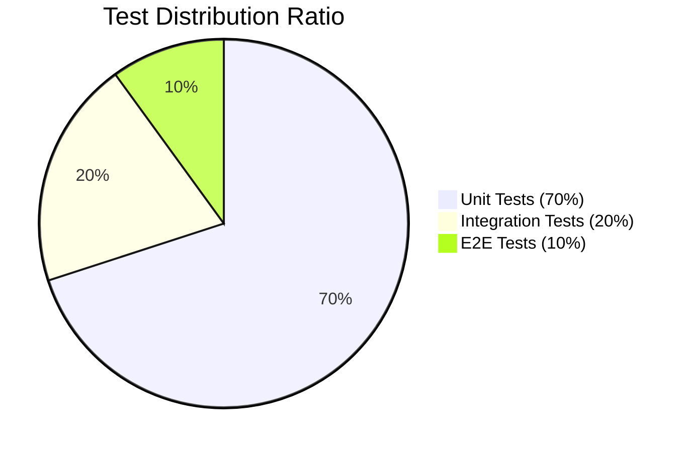

# Testomancer

**Software testing strategy and implementation guidance for AI agents**

Testomancer is a specialized skill designed for [Opencode](https://github.com/anomalyco/opencode) that transforms any AI agent into a senior software testing expert. It provides structured guidance on testing strategy, implementation best practices, and actionable recommendations across all testing levels.

## What It Does

Testomancer analyzes your codebase and delivers comprehensive testing recommendations:

- **Codebase Analysis** - Detects languages, frameworks, and architecture
- **Best Practices Audit** - Checks compliance with testing standards
- **Testing Level Recommendations** - Unit, Integration, Functional, or End-to-End
- **Library/Framework Suggestions** - With justification for your stack
- **Ready-to-use Code Templates** - Jumpstart your test implementation
- **CI/CD Integration** - Automation and reporting guidance
- **Effort/ROI Estimation** - Prioritize critical tests first

## Covered Testing Levels

| Level | Description |
|-------|-------------|
| **Unit Tests** | Test individual functions, methods, and classes in isolation |
| **Integration Tests** | Verify interactions between modules and external services |
| **Functional Tests** | Validate business requirements and user stories |
| **End-to-End Tests** | Test complete user flows from start to finish |

## Installation

> **Note:** Testomancer requires Opencode v0.5.0 or later. Run `opencode --version` to check your version.

### Option 1: Automatic Installation (Recommended)

Copy the `testomancer` skill folder to your Opencode skills directory:

```bash
cp -r testomancer ~/.agents/skills/
```

### Option 2: Manual Installation

1. Clone or download this repository
2. Copy the entire `testomancer` folder to:
   ```bash
   ~/.agents/skills/testomancer/
   ```
3. Restart Opencode

### Verify Installation

After installation, Testomancer will be automatically invoked when you ask testing-related questions:

```
"How should I test my Python API?"
"Create unit tests for my authentication module"
"What's the best testing strategy for my React app?"
```

## Usage

When Testomancer is active, it will:

1. Analyze your codebase structure
2. Perform a best practices audit
3. Confirm the optimal testing level
4. Provide prioritized recommendations with code examples
5. Offer next steps for implementation

### Quick Start

```testomancer
"How should I create unit tests for my Python authentication module?"
```

Expected Testomancer output:

```
1. Codebase Analysis
   - Detected: Python with pytest
   - Module: auth.py (authentication logic)

2. Testing Level: Unit Tests
   - Target: validate_credentials(), hash_password(), verify_token()
   - Use pytest-mock for external dependencies

3. Recommended Structure
   tests/
   ├── __init__.py
   ├── conftest.py           # Shared fixtures
   └── test_auth.py        # Unit tests

4. Template
   def test_validate_credentials_success():
       # Arrange
       credentials = {"username": "user", "password": "pass123"}
       # Act
       result = validate_credentials(credentials)
       # Assert
       assert result is True
```

### Example Response Structure

```
1. Codebase Analysis
   - Detected: Node.js + Express + PostgreSQL
   - Critical areas: Auth, Payment processing
   - Existing coverage: 45%

2. Best Practices Compliance
   - ✅ Good isolation on auth tests
   - ⚠️ Missing mocks on database calls
   - 💡 Suggest using test doubles

3. Recommendations
   - Priority: Unit tests for validation logic
   - Library: Jest + supertest for API testing
   - Templates included...

4. Next Steps
   - Ready to generate test code?
```

## Best Practices

Testomancer follows the **Testing Pyramid** principle:



| Level | Ratio | Speed | Reliability |
|-------|-------|-------|-------------|
| Unit Tests | ~70% | Fast (ms) | High |
| Integration Tests | ~20% | Medium (s) | Medium |
| E2E Tests | ~10% | Slow (min) | Lower |

- **More Unit Tests** at the base (fast, isolated, deterministic)
- **Moderate Integration Tests** in the middle
- **Fewer End-to-End Tests** at the top (slower, more complex)

### Core Principles

- Tests must be isolated, fast, and deterministic
- Use mocks/stubs judiciously
- Apply data-driven and property-based testing when relevant
- Target >80% coverage on critical code paths
- Integrate clear reporting in CI/CD pipelines

## Supported Languages & Frameworks (2026)

| Framework | Language | Type | Status |
|-----------|----------|------|--------|
| Selenium | Python/Java/JS/C# | Web (E2E) | Supported |
| Appium | Python/Java/JS | Mobile | Supported |
| Robot Framework | Python | Generic | Supported |
| Playwright | Python/JS/TS | Web (E2E) | Supported |

## Project Structure

```
testomancer/
├── SKILL.md              # Main skill definition
└── references/
    ├── unit_tests.md         # Unit testing guidance
    ├── integration_tests.md  # Integration testing guidance
    ├── functional_tests.md   # Functional testing guidance
    ├── e2e_tests.md          # End-to-end testing guidance
    ├── best_practices.md     # Testing best practices
    └── specific_rules.md     # Customizable testing rules
```

## Contributing

Contributions welcome! Please read the references in the `references/` folder for guidelines.

## Roadmap

Planned future enhancements:

- [ ] Integration with the appsec toolchain (security testing)
- [ ] Integration with ContinuousTesting by Digital.AI for remote launch of tests on Browsers and devices

## License

MIT
